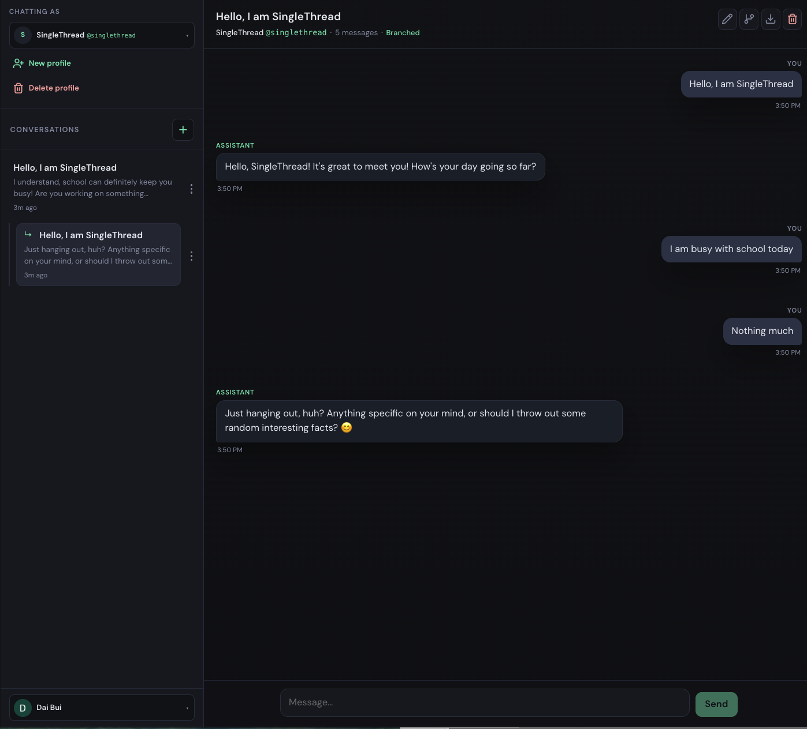

# Branching Thought — A Thinking Tool

A demo exploring a different philosophy for AI-assisted reasoning: instead of converging on a single answer, thinking develops through multiple independent perspectives that share only what they need to.

See [DESIGN.md](DESIGN.md) for the full design philosophy and motivation.


---

## The Problem With Linear Conversation

Current AI tools are optimized for one thing: understanding what you want and giving it to you. This is useful for tasks. It is limiting for thinking.

When a conversation is linear and memory is shared, a subtle problem emerges — the agent becomes increasingly anchored to your initial framing. The more context it accumulates, the less able it is to challenge that framing. Personalization and objectivity are in tension. A memory that makes the agent more helpful for routine tasks makes it less reliable for situations requiring genuine fresh judgment.

The deeper issue is epistemic: single-thread conversation enforces a single perspective on problems that are inherently multi-perspectival. A strategic decision, a design tradeoff, a personal situation — these do not have one correct angle. Understanding them requires holding multiple genuinely independent views simultaneously, not sequentially.

---

## The Design Idea

Conversation can be structured as a tree rather than a thread.

Branches share a common root — the context that grounds the inquiry — but develop independently below the point of divergence. Each branch can explore a different perspective, methodology, or set of assumptions without contaminating the others.

Memory sharing between branches is configurable. Sometimes perspectives should inform each other as they develop. Sometimes genuine independence requires isolation. The choice reflects a real epistemological decision about the problem at hand, and it should belong to the user.

This structure has a natural parallel in how rigorous thinking already works: a researcher running independent analyses before synthesis, a strategist developing a position and its strongest counter-argument without premature reconciliation, an engineer evaluating two architectures on their own terms before comparing them.

The branching tool makes this structure explicit and persistent.

---

## This Demo

This is an early prototype — enough to explore the interaction model and surface what is interesting and what is not. It is not intended as a production system.

The current implementation supports:

- **Branching conversations** from any point in a thread
- **Configurable memory sharing** between branches — shared or isolated
- **Persistent threads** across sessions for signed-in users
- **Multiple profiles** to scope conversation contexts

The AI layer is intentionally thin. The interesting question is not which model powers the branches but whether the branching structure itself changes how people think.

---

## Open Questions

This prototype is meant to explore rather than answer:

- Does reasoning through isolated branches produce genuinely different perspectives, or do they converge on similar framings regardless of isolation?
- When is memory sharing between branches productive versus contaminating?
- How do users naturally navigate a branching structure — do they explore breadth-first, depth-first, or return to the root repeatedly?
- Does the tool build thinking capacity over time, or does it create a different kind of dependency?
- What is the right interaction model for synthesis — explicit merging, side-by-side comparison, or something else?

---

## Stack

Next.js 15, React 19, TypeScript, Prisma, PostgreSQL, Auth.js.

---

## Setup

### Prerequisites

- Node.js 18+ (20+ recommended)
- PostgreSQL (or Docker)

### Install

```bash
npm install
```

### Letta (optional AI backend)

Pull the published image (default in `docker-compose.yml`):

```bash
docker-compose up -d letta_db letta
```

Build **from a local Letta clone** when you want (`../letta` by default, or set `LETTA_BUILD_CONTEXT`):

```bash
git clone https://github.com/daib/letta.git ../letta
npm run letta:compose:build
docker-compose -f docker-compose.yml -f docker-compose.letta-from-source.yml up -d letta_db letta
```

One step (rebuild then start):

```bash
docker-compose -f docker-compose.yml -f docker-compose.letta-from-source.yml up -d --build letta_db letta
```

Override clone path: `LETTA_BUILD_CONTEXT=/path/to/letta`. Override tag: `LETTA_DOCKER_IMAGE=my:tag`.

### Run

```bash
cp .env.example .env
```

Configure `DATABASE_URL` and Auth.js credentials (`AUTH_SECRET`, `AUTH_GOOGLE_ID`, `AUTH_GOOGLE_SECRET`).

### Database

```bash
docker-compose up -d db
npm run db:init
```

### Run

```bash
npm run dev
```

Open [http://localhost:3000](http://localhost:3000).

---

## Project Layout

| Path | Purpose |
|------|---------|
| `DESIGN.md` | Design philosophy and motivation |
| `prisma/schema.prisma` | Data model — accounts, profiles, conversations, messages |
| `src/components/ChatApp.tsx` | Main chat UI with branching support |
| `src/app/api/` | REST endpoints for conversations, messages, profiles |
| `src/lib/` | Shared utilities — auth, storage, data mapping |
| `docker-compose.yml` | Local Postgres |
